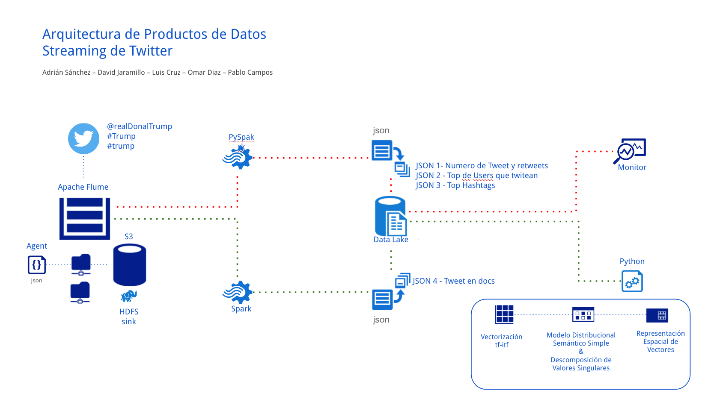
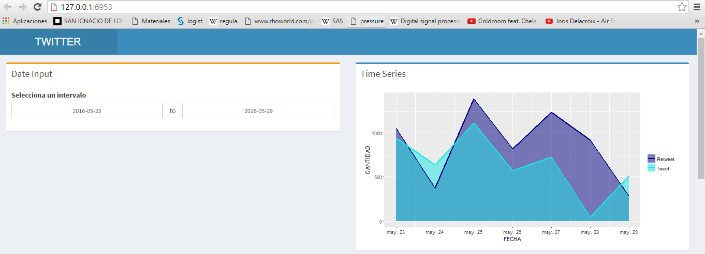
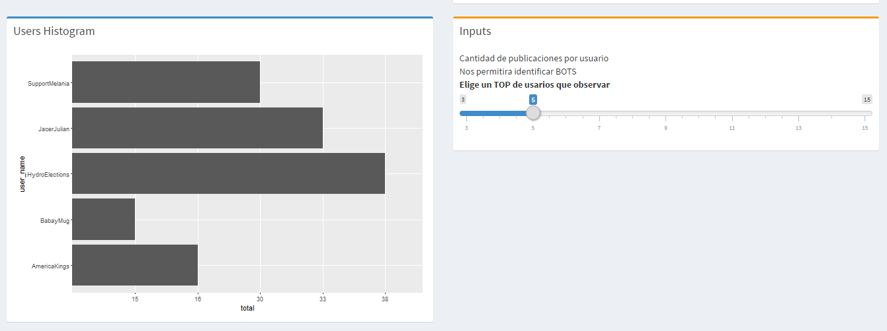
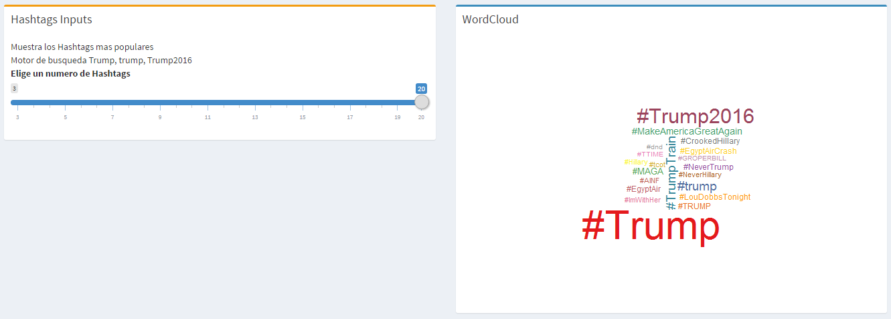

# Análisis del sentimiento de tweets

## Descripción y objetivos del proyecto
Este proyecto tiene como objetivo realizar un análisis de tweets relativos a la campaña presidencial de Donald Trump desde diferentes aristas, es decir, se pretende obtener estadísticas descriptivas de los tuits que contengan @realdonaldtrump, #Trump, #trump, #Trump2016 en su cuerpo, así como realizar un modelo estadístico que nos ayude a identificar los tópicos que rodean su carrera presidencial.

A lo largo de este documento se aboradarán cada uno de estos temas, comenzando en principio por el diseño de la arquitecutra, la descripción de las componentes que conforman el cluster junto con sus respectivas tareas, así como el detalle del modelo de minería de texto que se utilizó para identificar los diversos tópicos.

## Descripción de la arquitectura

El proyecto consiste de múltiples tecnologías y componentes organizados según los lineamientos de la [Arquitectura Lambda](http://lambda-architecture.net/), la cual define una arquitectura genérica, escalable y tolerante a faltas para el procesamiento de datos en _batch_.

Tal y como se puede observar en la gráfica anterior la arquitectura puede ser dividida en tres grandes fases:

* La lectura de la información (Flume, S3)
* Procesamiento de la información ( Luigi, Spark)
* Modelo Estadístico y Dashboard (Python, Shiny)

A continuación veremos una breve descripción de los componentes que definenen el ambiente.

## Ambiente

* Flume

Apache Flume es un servicio distribuido y seguro para la recolección, agregación y movimiento de grandes cantidades de datos.

La arquitectura de Flume es sencilla y está basada en flujos de datos en streaming. A grandes rasgos, la arquitectura de Flume posee tres elementos:

1) Fuente
2) Canal
3) Sumidero

En el caso de este proyecto la fuente es Twitter, mientras que el canal es de tipo memoria y el sumidero es el sistema de archivos
distribuidos S3 de Amazon.

[Imagen de Flume](https://github.com/jaradricc/trump/tree/master/ambiente/docker-images/flume)

* Luigi

Luigi es un entorno basado en Python para la construcción de pipelines. Esto permite construir grandes grafos de dependencias de tareas, en donde
las dependencias pueden incluir referencias recursivas de las tareas.

En este proyecto Luigi es utilizado para generar el pipeline y las dependencias entre las tareas, desde la ingesta de la información hasta
la escritura de los datos procesados hasta el Data Lake.

[Imagen de Luigi](https://github.com/jaradricc/trump/tree/master/ambiente/docker-images/luigid)

[Imagen de Luigi_worker](https://github.com/jaradricc/trump/tree/master/ambiente/docker-images/luigi_worker)

[etl](https://github.com/jaradricc/trump/tree/master/pipeline)

* Spark

Spark es un entorno de cómputo distribuido para el procesamiento de datos a gran escala. En este proyecto, Spark es utilizado
a través de su interfaz en Python para procesar los datos de Twitter que llegan a S3.

Más concretamente, en este proyecto SparkSQL se utiliza para dos tareas independientes.

1) Realizar las consultas necesarias para devolver los datos necesarios en formato JSON para ejecutar la aplicación en Shiny.

2) La extracción de los caracteres que conforman los Tweets para utilizar como entrada del modelo de Minería de Textos.

* Datalake

El DataLake es un método de almacenamiento de datos de un sistema que facilita la colocación de datos en diferentes esquemas y estructuras.
La idea general del DataLake es contar con lugar de almacenamiento que pueda tener desde datos crudos hasta datos transformados, el cual pueda ser consultado
por diferentes grupos de usuarios para múltiples propósitos; desde la aplicación de técnicas de modelado hasta la generación de reportes y herramientas de visualización.

En este proyecto el DataLake es utilizado para almacenar los datos que provienen de ambas tareas realizadas en PySpark. Posteriormente, estos datos son utilizados para
el monitoreo de los datos en la aplicación de Shiny y para la construcción del modelo de Minería de Textos.

* Python

Con esta herramienta estadística se realizó el modelo de minería de texto con el cual se ha decidido trabajar. Debido a que se ha construido un documento que detalla cada una de las técnicas utilizadas en este modelo, es preferible citar dicho trabajo, con la finalidad de darle robustez a este proyecto.

[Identificación, Clasificación y Agrupamiento de Tópicos de Tuits (Donald Trump)](https://github.com/jaradricc/trump/blob/master/ProyectoFinal_TwitterTrump.pdf)

* Shiny

Shiny es una herramienta para la construcción de aplicaciones web a partir de R. La aplicación realizada en este proyecto toma como insumos los datos provenientes
de la tarea realizada en PySpark que reúne, para cierto determinado período de tiempo:

1) Número de Tweets y Retweets.
2) Los usuarios que más realizan Tweets.
3) Los hashtags más populares.

A partir de estos datos, la aplicación muestra:

1) La serie de tiempo mostrando la evolución del número de Tweets y Retweets, para un período de fechas recientes elegidas por el usuario.

2) El Top de usuarios que más han realizado Tweets y su número de Tweets mediante una gráfica de barras, para un número de número de usuarios elegido por el usuario.

3) La nube de palabras para los hashtags más populares, con el número de hashtags a mostrar elegido por el usuario.

[Shiny](https://github.com/jaradricc/trump/tree/master/ambiente/docker-images/Shiny)

